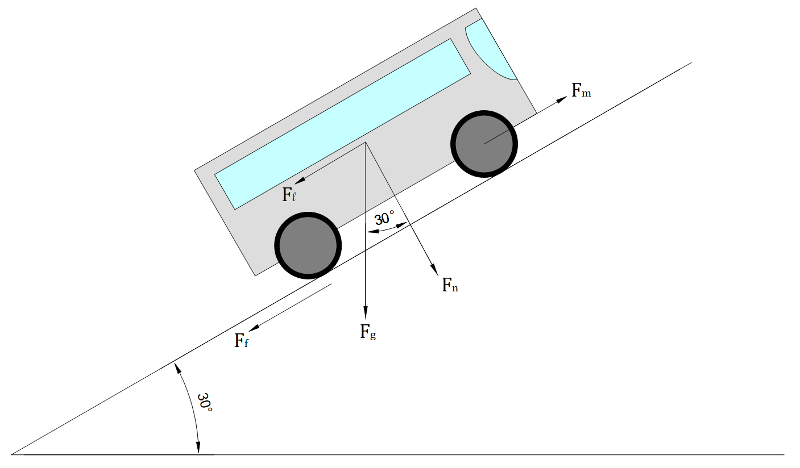

# Power Analysis of Electric Bus
This repository contains the code snippets for the power analysis of an electrical bus under various loading scenarios, weather conditions and vehicle parameters.

## Problem Statement:
Consider a front wheel driven electric bus travelling uphill a slope of 30&deg;. The mass of the bus is 16.2 tonnes and the total capacity of the bus is 50 passengers (excluding the driver). Assume average mass of each person to be 75 kg. Analyze the power required by the bus for diffenent loading conditions (no passengers (only driver), half passengers and all passengers) for the following conditions:
* Weather conditions: &mu; = 0.2, 0.3, 0.4, 0.5, 0.6, 0.7 and 0.8
* Wheel radius: r = 0.35 m, 0.4 m, 0.45 m and 0.5 m
* Vehicle speed: v = 30 kmph, 40 kmph, 50 kmph and 60 kmph
Consider the following motor parameters:
* Number of stator poles, P = 4
* Armature resistance, Ra = 20 k&ohm;
* Armature current, Ia = 5 A
